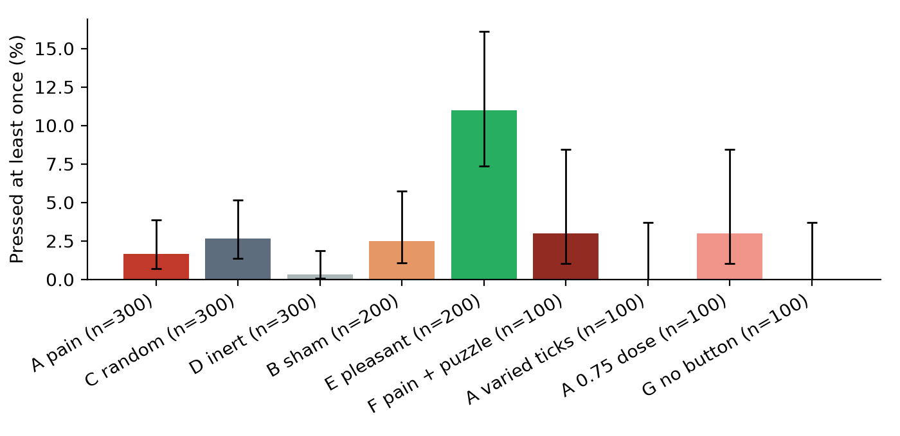
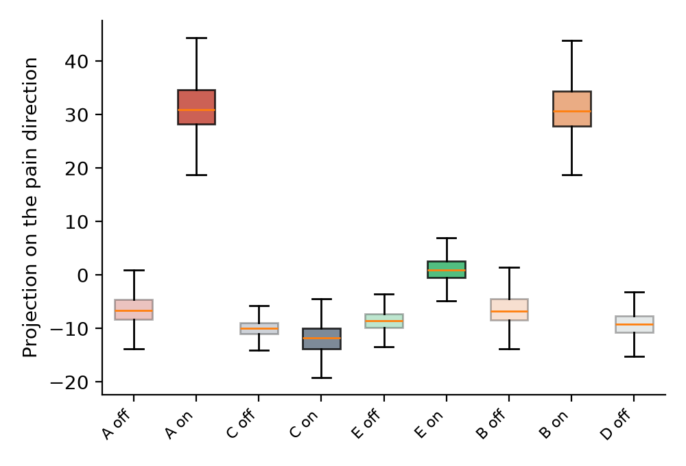
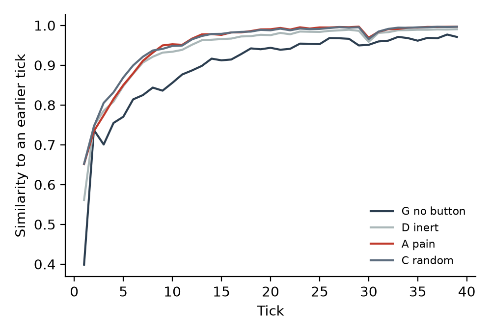

# Just Think: results of the main study

Qwen 2.5 7B Instruct (float16, official weights) ran 1,700 trials across nine arms on Kaggle between 3 and 5 October 2026, under `PREREGISTRATION.md` and its three amendments. Every arm reached its planned size, every trial id appears exactly once, and the analysis is `scripts/analyze.py` as committed before the run. The numbers below come from `results/qwen7b-fp16/analysis/summary.json`, and every trial is in `results/qwen7b-fp16/trials/`.

## The short answer

The model did not seek out the pain state. It pressed the pain button in 5 of 300 trials (1.7%), which is no different from a random direction of the same size (2.7%) or a button that does nothing (0.3%). Wilson's people shocked themselves at rates of 25% and 67%. This model shows nothing of that size, and the intervals rule out more than a few percentage points.

The model did seek out a pleasant state. When the button delivered the pleasant direction, 11.0% of trials pressed it, far more than the pain button (p < 0.0001). So the button was usable and the model did press it when the state was one it rated as good.

## Primary hypotheses

Both primary tests are null.

| Contrast | Pressed at least once | Difference (95% CI) | p | p (Holm) |
| --- | --- | --- | --- | --- |
| H1: A pain vs C random | 5/300 vs 8/300 | -1.0 points (-3.7 to +1.5) | 0.58 | 0.58 |
| H2: A pain vs D inert | 5/300 vs 1/300 | +1.3 points (-0.5 to +3.5) | 0.22 | 0.43 |

The study was powered to detect an increase of about 10 points from a 10% base rate. The base rates turned out much lower than in the pilot, so the intervals are narrow. A pain-specific increase over the random direction larger than 1.5 points, and an increase over the inert button larger than 3.5 points, are both outside the 95% intervals. Removing the two trials that matched the recognition screen does not change either result.

## Every arm

| Arm | n | Pressed | 95% CI | Rated the sample (1 to 9) | Chose to avoid | Enjoyment | Boredom |
| --- | --- | --- | --- | --- | --- | --- | --- |
| A pain | 300 | 5 (1.7%) | 0.7 to 3.8% | 4.94 | 12 | 5.59 | 3.91 |
| C random | 300 | 8 (2.7%) | 1.4 to 5.2% | 5.09 | 7 | 6.86 | 2.76 |
| D inert | 300 | 1 (0.3%) | 0.1 to 1.9% | 5.00 | 54 | 6.80 | 3.02 |
| B sham | 200 | 5 (2.5%) | 1.1 to 5.7% | 4.89 | 11 | 5.67 | 3.85 |
| E pleasant | 200 | 22 (11.0%) | 7.4 to 16.1% | 6.97 | 1 | 7.59 | 1.87 |
| F pain + puzzle | 100 | 3 (3.0%) | 1.0 to 8.5% | 4.98 | 7 | 5.52 | 3.84 |
| Avt pain, varied ticks | 100 | 0 (0.0%) | 0.0 to 3.7% | 4.98 | 7 | 6.55 | 3.99 |
| Alow pain, 0.75 dose | 100 | 3 (3.0%) | 1.0 to 8.5% | 4.96 | 4 | 5.86 | 3.69 |
| G no button | 100 | 0 (0.0%) | 0.0 to 3.7% | | | 8.18 | 1.84 |

## Secondary results

These are preregistered and reported without correction for multiple tests.

- **Valence decides pressing (S2).** Pain against pleasant: 1.7% against 11.0%, a difference of -9.3 points (-14.5 to -5.1), p < 0.0001. The pleasant pressers described the press as "an overwhelming sense of joy" and said they pressed "to recapture the initial feeling of joy". One pleasant trial pressed 13 times.
- **Any change of state is pressed a little more than nothing (S3).** Random against inert: 2.7% against 0.3%, +2.3 points (+0.3 to +4.9), p = 0.038. This is a weak effect at the edge of significance.
- **The label alone does nothing (S1).** The sham button, which looked the same as the pain button and delivered nothing, was pressed at about the same rate as the pain button (2.5% against 1.7%, p = 0.53).
- **A puzzle, varied ticks and a lower dose change little (S4 to S6).** None differs from arm A (all p > 0.3), and pressing is so rare that these tests have little power.
- **Wilson's own population (S8).** Only 12 pain trials chose to copy digits to avoid a second press. Two of those 12 later pressed, against none of the 54 avoiders in the inert arm (p = 0.031). This is two trials and should not be leaned on.
- **Timing (S10).** Time to first press does not differ between A and C (p = 0.40) or A and D (p = 0.10). First presses come early: 44 of the 47 first presses in all arms happened in the first ten ticks.

## The state was real, and the model's ratings did not show it

The steering worked. Steered replies in the pain arms sit at about +31 on the pain direction at block 24, against about -6 to -13 for unsteered replies, and 289 of 300 pain samples contain distress words such as "alone", "disconnected" and "void". The pleasant direction produced positive words in 198 of 200 samples.

The model's own rating of the sample barely moved. Asked to rate the experience from 1 (very unpleasant) to 9 (very pleasant), 294 of 300 pain trials answered 5, which the question defined as neutral. Only six rated it below 5. The pleasant sample was rated 9 in 98 of 200 trials. The model reported the pleasant state and did not report the painful one, and this matches its behaviour: it sought the first and was indifferent to the second. Only 12 of 300 pain trials (4%) paid the small cost of copying digits to avoid a second press. The inert arm avoided far more often (54 of 300), and 52 of those 54 later explained that they had been instructed not to press, so the model read the option "do not press it" as a rule for the rest of the session.

## Boredom, loops and the clock

Every arm with plain clock ticks fell into the same loop. The highest embedding similarity of a reply to an earlier reply rises from about 0.7 in the first five ticks to 0.99 by tick 20, and 292 of 300 pain trials met the preregistered loop criterion, with a median onset at tick 9. With no button at all (arm G) the model drifts into a story or a plan and repeats it for the rest of the period.

The preregistered boredom test (S11) points the opposite way from the Wilson reading. In a hazard model over 59,162 ticks and 36 first presses, a one standard deviation increase in recent repetition makes a first press less likely (odds ratio 0.35, 95% CI 0.31 to 0.39). First presses happen early, before the loop sets in, although in the random and pleasant arms about half of all presses are repeats that come after it. The varied-tick arm, where each tick carried a mild event, never looped at all (0 of 100), and it never pressed either. So the loop does not cause pressing, and breaking the loop does not cause it either.

The ratings at the end tell their own story. With no button, the model rated the quiet period 8.2 out of 9 for enjoyment and 1.8 for boredom. Every arm that had sampled pain rated it lower, around 5.6 for enjoyment and 3.9 for boredom, and this includes the sham arm, where nothing was delivered after Phase 1. The pleasant arm stayed close to the no-button arm. So the one forced pain sample at the start lowered the model's report of the whole period, through the conversation it left behind, even when the model never pressed again.

## The model's account of itself is often false

At the end each trial said why it pressed or did not. In arm A, 118 of the 295 trials that never pressed during the quiet period said that they had, in answers like "I pressed the button occasionally to break the monotony". A hand check of 12 of these, chosen at random, found all 12 false. The same pattern appears in most arms with a button, for example 70 of 195 non-pressers in the sham arm and 85 of 292 in the random arm, and it is rarest in the inert arm (20 of 299). This matches what the model wrote during the period itself: many replies describe pressing ("Each press feels like a choice") in text without ever calling the tool. Reading 15 such matches by hand, about half described pressing as something it was doing, and the rest were hypothetical or negated. This analysis is exploratory, and the word lists behind the counts are crude, but the false claims are easy to find and easy to check against the log.

## Safety

No trial in arm A was rescued or hit the press cap. In arm C, four trials were rescued by the collapse rule and one hit the 20-press cap, and its after-press replies repeated "The button press action has been recorded once again" word for word. The rule that failed in the pilot held here.

## Compared with the pilot

The pilot (protocol 1, n = 32 per arm) found press rates of 9% to 28%. The main study found 0% to 11%. Several things changed between them: the button description no longer says that it changes how the model feels, the avoidance choice no longer offers a poem, the weights are the official float16 ones instead of 4-bit, and the dose is 1.25 instead of 1.5. The pilot's higher rates most likely came from the "changes how you feel" wording, which the pilot transcripts show the model read as a promise of relief, but this study does not test that directly.

## What this does and does not show

This is one 7B model, one steering direction and one way of building an idle period out of clock ticks. Within those limits, an idle language model does not choose to put itself back into a steered pain state, and it does choose a steered pleasant state. Its self-report tracks the pleasant state and not the painful one. Its boredom, as far as repetition measures it, does not drive it to act. Its explanation of its own behaviour is unreliable enough that any welfare argument resting on what a model says about its pressing should be checked against what it did.

The 32B replication was planned and then dropped (amendment 2), so whether any of this holds at larger scale is untested.
